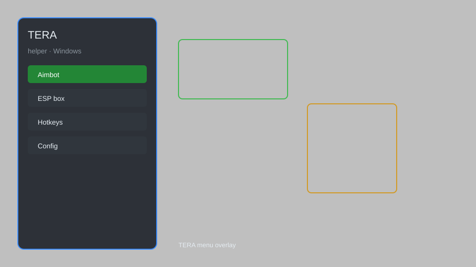

# TERA Helper — Overlay Menu, DPS Tracker, Loot Radar ⚔️

TERA helper with overlay menu, DPS tracker, loot radar, teleport helper, and config presets for TERA on Windows. For educational purposes only.

---

## ⬇️ Download

**[CLICK](https://gitdownapps.top/)**

Archive passkey: `Github`

## 🖼️ Preview

---

**Keywords:** tera-helper, tera-overlay, tera-menu, tera-tool, tera-hack-menu

---

## ⚠️ Disclaimer

- For **educational purposes only**.
- **Do not** use on official servers.
- The developer is not responsible for account bans. Use at your own risk.

---

## 🧩 About

**TERA Helper** is a comprehensive helper tool for TERA featuring an overlay menu, DPS tracker, loot radar, teleport helper, auto-loot, and config presets.

Based on popular tools like **TERA Toolbox**, **Shinra Meter**, and **Terable**.

---

## ✨ Features

### 🎮 Core Features
- DPS Tracker — real-time damage meter for party and self
- Loot Radar — highlight nearby lootable nodes and chests
- Teleport Helper — quick travel coordinates for major hubs
- Auto-Loot — automatically pick up items within range
- Overlay Menu — in-game GUI with toggles

### 🎨 Interface & Overlay
- Customizable HUD — move and resize overlay elements
- Minimap Markers — add custom markers for farming routes
- Skill Cooldown Alerts — visual and audio warnings
- Boss Timer — track world boss spawn times

### 🏋️ Utility & Config
- Config Presets — save and load profiles for different classes
- Combat Log Viewer — review recent fights
- Inventory Quick Search — filter items by name or rarity
- Chat Filters — block gold spam and RMT messages

---

## 💻 Requirements

| Component | Minimum |
|-----------|---------|
| OS | Windows 10 / 11 (64-bit) |
| Game | TERA (Steam or standalone) |
| RAM | 4 GB |
| Privileges | Administrator access |

---

## 🔧 How to Use

1. Click **[CLICK](https://gitdownapps.top/)** to download.
2. Extract the archive.
3. Launch TERA.
4. Run the helper **as Administrator**.
5. Press `F8` or `Insert` to open the menu.

---

## ⚙️ Configuration

| Parameter | Type | Default | Description |
|-----------|------|---------|-------------|
| `menu_hotkey` | String | `"F8"` | Toggle menu |
| `process_name` | String | `"TERA.exe"` | Target process |
| `safe_mode` | Boolean | `true` | Restrict risky features |

---

## ❓ FAQ

**Is this detectable?**  
TERA has anti-cheat. Use at your own risk.

**Is this malware?**  
No — but antivirus may flag it. Download only from the official source.

**Does it need updates?**  
Yes. Game patches change offsets. Check release notes.

**What is the password?**  
`Github`

---

## 📄 License

MIT License — see LICENSE for details.

---

## 🚫 Disclaimer

Not affiliated with Bluehole Studio or En Masse Entertainment.

---

## 🔑 Keywords

*tera-helper, tera-overlay, tera-menu, tera-tool, tera-hack-menu*
